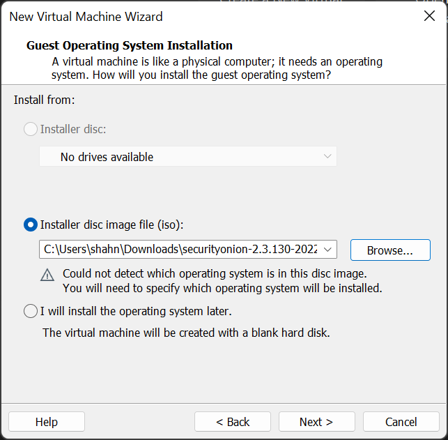
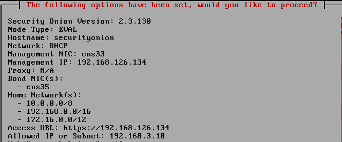

# HomeLab-Setup
HomeLab Setup with a Firewall, SIEM Solution, Exploitable machines and an Attacker.

# What is a Homelab?
A Homelab is an environment meant to simulate enterprise components and configuration. The goal here is to understand the process of installing, configuring, maintaining and updating this entire infrastructure. We are building a virtualized Homelab as it is beginner friendly and easier to configure and spin up.

# Tools
- Attacker - Parrot Security OS
- Firewall - pfSense
- IDS - SecurityOnion
- SIEM - Splunk
- Hypervisor - VMWare/Virtualbox
- Domain Controller - Windows Active Directory
- Vulnerable Machines - Ubuntu, Windows, DVWA

# Network Design


# Guide
## Selecting and Downloading a Hypervisor
We will need a Hypervisor to install all of our tools and services.

I'll be using VMWare Workstation, being a student I get a license for it for free. Although VirtualBox is also a great free alternative as a Hypervisor. 

You can download VMWare Workstation at -

[VMWare Workstation Download](https://www.vmware.com/products/workstation-pro/workstation-pro-evaluation.html)

You can download VirtualBox at - 

[Virtualbox Download](https://www.virtualbox.org/wiki/Downloads)

## Installing and Configuring the Firewall - pfsense
pfsense will act as the edge of our Homelab virtual network and will be only accessible from the Parrot Machine. 

pfsense community edition can be downloaded from - [pfsense community edition ISO](https://www.pfsense.org/download/)

You can follow these steps to install & configure pfsense -
1. Open VMWare Workstation & Create a new Virtual Machine with the "Typical (recommended)" setting. 
   
2. Browse the pfsense CE ISO file and select Next.    
(You might need to extract the ISO file from your pfsense download as it is usually zipped.)


3. Change your VM name to "pfsense" & click Next.
   
4. Leave the disk size to 20GB and ensure split virtual disk into multiple files option is selected.
   


5. Click on customize hardware and increase the memory limit to 1GB.

6. Add 5 Network Adapters and correspond them with a VMnet interface as per the image by selecting Custom specific Virtual Network. 


7. Select Finish. The pfsense machine will power on and you can accept all the default values, after that pfsense will boot.

8. Press Install, and select all the default configurations. 


9. After the pfsense is done rebooting you will reach this screen.
     


10.  Select option 1 to set up the VLAN. Follow by - 
    
**'Should VLAN's be set up now [y|n]?' - n**

Enter the interfaces in respective order for each prompt - 
1. em0 -> WAN
2. em1 -> LAN
3. em2 -> Optional 1
4. em3 -> Optional 2
5. em4 -> Optional 3
6. em5 -> Optional 4

**'Do you want to proceed [y|n]?' - y**


11.  Select option 2. We will configure the LAN Interface so select 2 again.

We will use IP Address **192.168.1.1** to access the pfsense WebGUI. Configure the LAN Interface same as below.


For, **'Do you want to revert to HTTP as the webConfigurator protocol? (y/n)' - n**

12. The Configuration for OPT1 Interface is - 


13. The Configuration for OPT2 Interace is - 


14. The OPT3 Interface should be left without an IP as it is going to have the span port with traffic that the IDS (Security Onion) is going to be monitoring.

15. The Configuration for OPT3 Interface is - 


16. With this we have configured the pfsense VM. Rest of the configuration will be done using the Parrot Machine through the WebConfigurator.

## Installing and Configuring the IDS - Security Onion
Security Onion is an open-source IDS, Security Monitoring and Log Management solution. 

You can download Security Onion from - 

[Security Onion Download](https://github.com/Security-Onion-Solutions/securityonion/blob/master/VERIFY_ISO.md)

Follow these steps to install and configure Security Onion for our network - 

1. Open VMWare Workstation and select Typical Installation -> Next
   
2. Click on installer disc image file and browse & select the Security Onion ISO file -> Next
   


3. Choose Linux in Guest Operating System and CentOS 7 64-bit -> Next


4. Put in SecurityOnion as the VM name -> Next

5. Specify disk size (**minimum 200GB**) make sure to store it as a single file -> Next


6. Click 'Customize Hardware' -> Increase Processor to 2 -> Change memory to 4-32GB (I recommend atleast 8 GB)-> Add 2 Network Adapters and assign them Vmnet4 & Vmnet5


7. Click Finish and Bootup the 'SecurityOnion' VM -> Click Enter on the 'Installing Security Onion in basic graphic mode'
   
8. After loading, enter 'yes' when you get this prompt.


9. Set a username and password for the administrator account -> After Security Onion reboots enter those credentials -> Select Yes


10. Select 'Run the standard Security Onion installation'

11. Select the EVAL option


12. Type 'Agree'

13. Select a hostname, I kept the default

14. Use spacebar to select ens33 as the management interface -> Press Enter


15. Select DHCP to set up the the management interface

16. Select 'YES' -> Select 'OK' -> Select 'Standard' for how this manager should be installed. 

17. Select 'Direct' -> After preflight checks, select ens35 as the Monitor Interface


18. Select 'Automatic' for the OS patch schedule -> Accept all default values for  Home Network CIDR ranges, Docker IP Range, 

19. Enter Email Address and password for your Email account for Admin account

20. Select 'IP' for access to web interface -> Select 'Yes' for NTP server and accept defaults.

21. Enter '192.168.3.10' when asked for an IP address to access Web Interface


22. Take a screenshot of the final settings, **Especially the Web Access IP Address**



23. You will get this prompt at the end of installation of Security Onion.


24. Next we will access the Security Onion Interface from our VLAN Network which normally the SOC will do. Any machine like Ubuntu or any other flavour in the network will work and you can set it up on your own. I am using Kali as I have it already installed.
    
25. After the VM is installed you can get the IP Address of the machine and add it to the Security Onion instance by running the command 

```
sudo so-allow
```

Enter your password -> Type 'a' and wait for the process to complete. 


This will create a firewall rule on Security Onion for the Kali Linux machine that will allow you access to the Web Interface.

26. Go to the Security Onion web interface address on the Kali Machine. You can login in it using the Email ID and Password you provided during the setup. 
    


27. Your Security Onion is configured. 

## Configuring Parrot OS Machine

I have used Kali Machines extensively before, but I wanted to try out Parrot OS that is why I will be using a Parrot OS as an attack machine to perform offensive attacks against the Domain Controller (Windows Active Directory) and other machines on the virtual network. You can use the Kali Machine if you like. 

[Parrot OS Download Link](https://www.parrotsec.org/download/)


[Parrot OS Installation Guide on VMWare](https://www.parrotsec.org/docs/parrot-on-vmware.html)

After installing the Parrot OS iso as a new VM in VMWare Workstation, before booting it change the Network Adapter to Vmnet2 and its Memory to 4GB. 


Power on the machine using the credentials during the setup.

The Parrot OS Machine is ready to use.


